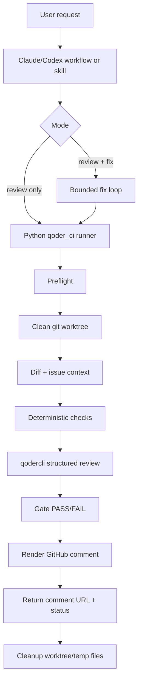

# Local Qoder CI PRD

## 1. Decision

Build this as a **Claude/Codex-triggered workflow backed by a Python runner**.

- **Python runner** owns the deterministic parts: repo checkout/worktree, diff generation, command execution, Qoder invocation, JSON parsing, GitHub comment posting, cleanup, and exit codes.
- **Claude/Codex workflow or skill** owns the human-facing orchestration: when I say “create PR and run Qoder CI” or “PR and fix”, it gathers the issue/PR context, invokes the runner, decides whether to enter the fix loop, and reports the final comment link + PASS/FAIL.
- **Bash script** stays only as a thin wrapper or MVP prototype.
- **Qoder skill-only** is not the core implementation. Skills are good for prompt templates and invocation conventions, but not strong enough for safe worktree lifecycle, retries, structured parsing, and cleanup.

> [!important] Bottom line
> Use **Python as the engine**, wrapped by a **Claude/Codex workflow/skill**. Do not rely on a hidden git hook or a pure bash script as the long-term solution.

## 2. Current verified baseline

Verified on 2026-06-29 local host:

| Area | Current result |
|---|---|
| `qodercli` path | `/home/daishun/.local/bin/qodercli` |
| Version | `1.0.28` |
| Account status | Logged in locally |
| Non-interactive mode | `qodercli -p "..."` works and exits |
| Attachment support | `--attachment <file>` is available |
| Output format | `-o, --output-format <format>` is available |
| Work directory | `--cwd <dir>` is available |
| Worktree flag | `--worktree [name]` is available, but this PRD still prefers explicit git worktree control in the runner |
| Permission mode | `--permission-mode <mode>` is available |
| Skills | `qodercli skills ...` exists |
| Hooks | `qodercli hooks migrate` exists, but hooks are not selected for this product |
| GitHub CLI | `gh pr comment`, `gh issue comment`, and related commands are usable for comment posting |

Documentation note: Context7 resolved Qoder as `/websites/qoder`, but `query-docs` failed during this pass. The official docs pages were also blocked by a security checkpoint from direct curl. The PRD therefore uses **live local CLI help/status/prompt verification** as the current source of truth. Re-check Qoder docs before implementation if the CLI version changes.

## 3. Problem

When I create a PR, I want a local, repeatable AI review gate that:

1. Reads the linked issue as the requirement and acceptance criteria.
2. Reviews the exact PR diff in a clean workspace, not my dirty working tree by accident.
3. Runs deterministic checks before AI judgment.
4. Calls `qodercli` headlessly for a structured PR review.
5. Posts a clean GitHub PR comment with a clear first-line `PASS` or `FAIL`.
6. Returns the PR comment link and final status to the user.
7. If explicitly asked to fix, runs a bounded fix loop: plan -> edit -> commit -> push -> rerun review, up to 3 cycles.
8. Cleans temporary worktrees and files when complete.

This is “local CI”: it can run from this machine immediately. GitHub Actions support is a later phase after Qoder headless auth is proven in an isolated CI environment.

## 4. Goals

### G1. One-command PR review

Given an issue ID/link and a PR branch or PR number, produce:

- PR link.
- Qoder review comment link.
- Final `PASS` or `FAIL`.
- Clear reason for failure if any.

### G2. Clean isolated review workspace

Every review run must use a clean git worktree/check-out of the PR state.

The runner must not review accidental local dirty edits unless the user explicitly asks for “working tree review”.

### G3. Deterministic checks first

Before asking Qoder, run configured repo checks such as:

- formatting check
- lint
- unit tests
- build/export check
- repo-specific smoke test

Qoder review must receive the check results as context, but deterministic failure is enough to mark `FAIL` even if Qoder is optimistic.

### G4. Structured AI result

Qoder must return a machine-readable result first, then the runner renders the GitHub comment.

Required statuses:

- `APPROVE`
- `COMMENT`
- `REQUEST_CHANGES`

Default gate:

- `APPROVE` + deterministic checks pass -> `PASS`
- `COMMENT` -> `FAIL` by default, unless explicitly configured as advisory
- `REQUEST_CHANGES` -> `FAIL`
- invalid/unparseable Qoder output -> `FAIL`

### G5. Safe fix loop

Only when the user says “PR and fix” or equivalent:

1. Read issue acceptance criteria and failure comment.
2. Make a short fix plan.
3. Apply edits in the PR branch/worktree.
4. Commit and push.
5. Rerun local Qoder CI.
6. Stop on `PASS`, or after 3 failed loops.

## 5. Non-goals

- Not a replacement for normal tests/builds.
- Not an auto-merge bot.
- Not a hidden post-commit hook.
- Not a generic “ask AI if code is good” script without issue/AC context.
- Not GitHub Actions first. Actions come later only after headless Qoder auth is proven.
- Not allowed to hide failure by disabling checks, shrinking context, or removing capabilities.

## 6. Users and trigger phrases

| User intent | Example trigger | Behavior |
|---|---|---|
| Create PR + review | “Create PR for issue #12 and run Qoder CI” | Create/push PR, run review once, post comment, return link + PASS/FAIL |
| Review existing PR | “Run Qoder CI on PR #42 with issue #12” | Checkout PR in clean worktree, run review once, post/update comment |
| Review and fix | “PR #42 and fix with Qoder CI” | Run review; if fail, Codex fixes and reruns up to 3 times |
| Dry run | “Preview Qoder CI for this branch” | Run locally, do not post GitHub comment |

## 7. Recommended architecture



### Components

| Component | Form | Responsibility |
|---|---|---|
| Human entrypoint | Claude/Codex skill/workflow | Interpret request, enforce max loops, decide whether fixing is allowed |
| Runner | `scripts/qoder_ci.py` | Deterministic automation, subprocess calls, JSON parsing, comments, cleanup |
| Wrapper | `scripts/qoder-ci` or existing `.sh` | Optional convenience command that calls Python |
| Config | `.qoder-ci.yml` | Repo-specific checks, paths, Qoder prompt profile, comment behavior |
| Qoder prompt template | Markdown file or embedded Python template | Stable review contract and JSON schema |
| GitHub API layer | `gh` via subprocess first | Create/update comments, get issue/PR metadata, return comment URL |

## 8. Approach comparison

| Approach | Strength | Weakness | Decision |
|---|---|---|---|
| Skill-only | Natural to invoke; good for instructions and templates | Weak for robust cleanup, retries, JSON validation, exit codes, worktree lifecycle | Use only as wrapper/orchestrator |
| Bash script | Fast, transparent, already prototyped | Brittle for multi-step state, JSON parsing, GitHub API response handling, fix loops | Keep as MVP/thin wrapper, not core |
| Python | Strong argument parsing, subprocess control, JSON schema validation, temp dirs, retries, logs, tests | Slightly more code upfront | **Best core runner** |
| Claude workflow | Best at planning/fixing and interpreting issue requirements | Not deterministic enough as the sole CI layer | **Best top-level orchestration**, backed by Python |
| Git hooks | Automatic | Hidden side effects, hard to control, wrong boundary for PR-level review | Do not use |
| GitHub Actions | True CI surface | Blocked until Qoder headless auth is proven | Later phase only |

## 9. Product workflow

### 9.1 Review-only flow

1. User provides issue ID/link and target branch or PR number.
2. Workflow checks repo status and refuses ambiguous dirty state unless explicitly allowed.
3. If PR does not exist, create PR with `gh pr create` and link the issue in the body.
4. Runner creates a clean worktree under a temp root, for example:
   - `/tmp/qoder-ci/<repo>/<pr-number>-<short-sha>`
5. Runner fetches base and PR head.
6. Runner generates:
   - diff file
   - diff stat
   - changed-file list
   - issue context
   - PR title/body context
   - deterministic check logs
7. Runner calls Qoder with attached context.
8. Runner parses Qoder result.
9. Runner renders a comment and posts/updates it on the PR.
10. Workflow returns:
    - `PASS` or `FAIL`
    - PR URL
    - comment URL
    - short reason
11. Runner removes the worktree and temp files.

### 9.2 Fix flow

Fix flow is review-only flow plus a bounded loop.

Loop contract:

```text
max_loops = 3
for each loop:
  run local qoder ci
  if PASS: stop
  if not allowed_to_fix: stop
  if failure is auth/env/non-actionable: stop
  Codex writes fix plan
  Codex edits PR branch
  run deterministic local checks before commit when possible
  git commit
  git push
continue
```

Stop reasons:

- `PASS`
- 3 loops reached
- Qoder/auth failure
- deterministic check failure that cannot be fixed safely
- dirty/untracked workspace conflict
- issue requirements are ambiguous
- user did not authorize fixing

## 10. Runner CLI design

Preferred command surface:

```bash
# Review current branch and create/update PR comment
python scripts/qoder_ci.py review \
  --issue 12 \
  --base origin/main \
  --post

# Review existing PR
python scripts/qoder_ci.py review \
  --pr 42 \
  --issue 12 \
  --post

# Dry run, no GitHub post
python scripts/qoder_ci.py review \
  --pr 42 \
  --issue 12 \
  --dry-run

# Machine-readable output for agent workflow
python scripts/qoder_ci.py review \
  --pr 42 \
  --issue 12 \
  --post \
  --json-out /tmp/qoder-ci-result.json
```

Output JSON schema:

```json
{
  "status": "PASS",
  "gate": {
    "checks_passed": true,
    "qoder_status": "APPROVE"
  },
  "repo": "owner/name",
  "pr_number": 42,
  "pr_url": "https://github.com/owner/name/pull/42",
  "issue_url": "https://github.com/owner/name/issues/12",
  "base_ref": "origin/main",
  "head_sha": "abc123",
  "comment_url": "https://github.com/owner/name/pull/42#issuecomment-...",
  "summary": "short human summary",
  "fail_reasons": [],
  "artifacts": {
    "diff": "/tmp/.../diff.patch",
    "checks_log": "/tmp/.../checks.log",
    "qoder_raw": "/tmp/.../qoder.raw.json"
  }
}
```

## 11. `.qoder-ci.yml` config

Example:

```yaml
version: 1

review:
  max_diff_bytes: 300000
  qoder_model: qmodel_latest
  qoder_timeout_seconds: 900
  comment_status_is_failure: true
  update_existing_comment: true

checks:
  - name: unit tests
    command: make test
    required: true
  - name: lint
    command: make lint
    required: false

context:
  include_issue: true
  include_pr_body: true
  include_diff_stat: true
  include_check_logs: true
  include_repo_docs:
    - README.md
    - docs/02_prd

comments:
  marker: "<!-- qoder-local-ci:v1 -->"
  title: "Qoder Local CI"
```

The runner must tolerate missing config by using safe defaults:

- no post unless `--post`
- no fix unless requested by the agent workflow
- fail closed on invalid Qoder output
- cleanup on exit

## 12. Qoder prompt contract

The runner should ask Qoder for strict JSON first:

```text
You are reviewing this PR against the linked issue and acceptance criteria.
Use the attached files as source material.

Return ONLY valid JSON with this schema:
{
  "approval_status": "APPROVE | COMMENT | REQUEST_CHANGES",
  "summary": "1-3 sentences",
  "acceptance_criteria": [
    {"criterion": "...", "status": "met | not_met | unknown", "evidence": "..."}
  ],
  "issues": [
    {
      "severity": "blocker | major | minor",
      "file": "path or null",
      "line": "line/range or null",
      "title": "short title",
      "detail": "specific reason",
      "suggested_fix": "concrete next action"
    }
  ],
  "recommended_next_action": "merge | fix | inspect_manually"
}
```

Then the runner renders markdown from the JSON. This avoids fragile parsing of free-form review text.

If Qoder returns invalid JSON, the runner should:

1. Retry once with a stricter “repair JSON only” prompt.
2. If still invalid, mark `FAIL` and include the raw output in artifacts, not in the PR comment unless safe.

## 13. GitHub comment template

Comment must begin with a clear status.

```markdown
<!-- qoder-local-ci:v1 pr=42 sha=abc123 -->

# FAIL — Qoder Local CI

| Field | Value |
|---|---|
| PR | #42 |
| Issue | #12 |
| Commit | abc123 |
| Base | origin/main |
| Qoder | REQUEST_CHANGES |
| Deterministic checks | 3 passed, 1 failed |
| Mode | review-only |

## Summary

...

## Blocking issues

1. ...

## Acceptance criteria check

| Criterion | Status | Evidence |
|---|---|---|
| ... | not_met | ... |

## Next action

Fix the blocking issues, push a new commit, and rerun Qoder Local CI.
```

For `PASS`:

```markdown
# PASS — Qoder Local CI
```

The runner should update its previous comment when possible. If update fails, create a new comment and return its URL.

## 14. PASS/FAIL rules

| Condition | Result |
|---|---|
| Required deterministic check fails | `FAIL` |
| Qoder output invalid after retry | `FAIL` |
| Qoder says `REQUEST_CHANGES` | `FAIL` |
| Qoder says `COMMENT` | `FAIL` by default |
| Qoder says `APPROVE` and required checks pass | `PASS` |
| Missing issue/AC context | `FAIL`, unless user explicitly requests diff-only review |
| Auth failure for `qodercli` or `gh` | `FAIL` |
| Worktree cleanup failure | Review result remains, but final response must warn clearly |

## 15. Security and reliability

- Never print or post `QODER_TOKEN`, `GITHUB_TOKEN`, cookies, or auth files.
- Do not depend on `~/.bashrc` in CI-like shells. Environment variables must be explicit.
- Before sending diff/context to Qoder, run a lightweight secret scan if available.
- Attach only necessary context: issue, PR body, diff, check logs, selected docs.
- Use temp directories and remove them on exit.
- Fail closed: if the runner cannot prove the review target, auth, or output status, report `FAIL`.
- Do not install git hooks for this workflow.

## 16. Headless auth risk

Local browser login works today. Real headless CI still needs proof.

Open validation task:

```bash
# Example concept: run with isolated HOME or clean config to prove token-only auth.
HOME="$(mktemp -d)" \
QODER_TOKEN="$QODER_TOKEN" \
qodercli -p "Return exactly OK" --max-output-tokens 20
```

Acceptance for GitHub Actions support:

- Qoder can run without browser login.
- Token comes only from GitHub Actions secrets.
- `qodercli status` or equivalent does not require an interactive browser.
- A real PR comment can be posted from a runner.

Until this passes, keep the product as **local CI**.

## 17. MVP implementation plan

### Phase 0 — Keep current bash as prototype

- Preserve the existing `scripts/qoder-ci-review.sh` idea as evidence.
- Do not expand it into the final system.

### Phase 1 — Python one-shot review

Deliver:

- `scripts/qoder_ci.py review`
- clean worktree creation/removal
- issue/PR fetch via `gh`
- diff generation
- deterministic checks from `.qoder-ci.yml`
- Qoder JSON review
- markdown comment rendering
- dry-run and `--post`
- JSON result output

Acceptance:

- Can review an existing PR and post/update one comment.
- Returns comment URL and `PASS`/`FAIL`.
- Leaves no temp worktree after success or failure.

### Phase 2 — Workflow/skill wrapper

Deliver a Claude/Codex skill or workflow instruction:

- required input: issue ID/link
- optional input: PR number, branch, base
- mode: `review` or `fix`
- max fix loops: 3
- required final response: PR URL, comment URL, `PASS`/`FAIL`, short reason

Acceptance:

- User can invoke it naturally.
- The workflow never fixes unless the user explicitly asks.
- The workflow uses the Python runner instead of reimplementing CI logic in prose.

### Phase 3 — Fix loop

Deliver:

- failure classification
- Codex plan step before edits
- commit/push after each fix
- rerun runner
- stop after 3 loops

Acceptance:

- Each loop creates one clear commit unless no safe fix exists.
- Final PR comment reflects the latest commit.
- Final response states loop count and stop reason.

### Phase 4 — Optional GitHub Actions

Only after token-only Qoder auth is proven:

- add workflow with `pull_request` trigger
- set `contents: read`, `pull-requests: write`, `issues: write`
- run Python runner in `--post` mode
- store Qoder/check artifacts

## 18. Test plan

| Test | Expected |
|---|---|
| `--dry-run` on small diff | Produces local markdown + JSON result, no GitHub comment |
| `--post` on test PR | Creates or updates one PR comment and returns URL |
| missing issue | Fails closed with clear message |
| missing `qodercli` | Fails before worktree/diff |
| missing `gh` auth | Fails before posting, dry-run still possible |
| deterministic check fail | Final status `FAIL` even if Qoder approves |
| Qoder invalid JSON | Retry once, then `FAIL` |
| temp cleanup on error | Worktree removed or warning shown |
| fix mode max loops | Stops at 3 loops and reports final failure |
| review-only fail | Does not edit code |

## 19. Open questions

1. Should `COMMENT` be hard `FAIL` always, or configurable as warning?
2. Which repo checks should be the default for each repo?
3. Where should the reusable skill live: global Codex/Qoder skill or repo-local workflow doc?
4. Should comment updates edit the previous comment or always create a new audit trail comment?
5. What is the maximum diff size before the runner switches to summarized/chunked review?
6. Can `QODER_TOKEN` authenticate in a clean non-browser environment, or is local account state still required?

## 20. Final recommendation

Start with this implementation order:

1. **Python runner**: reliable local PR review engine.
2. **Claude/Codex workflow/skill**: human-friendly command layer and fix-loop controller.
3. **Thin bash wrapper**: convenience only.
4. **GitHub Actions**: only after token-only Qoder auth is proven.

This gives the right boundary: deterministic automation in code, AI judgment in Qoder, and repair/planning in Claude/Codex only when explicitly authorized.
